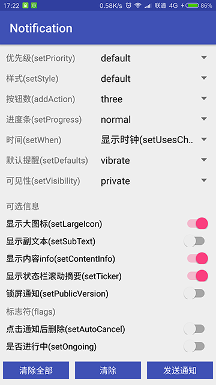
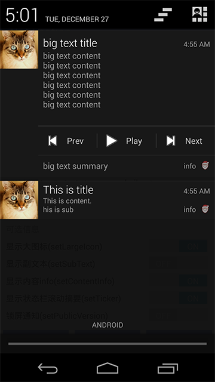
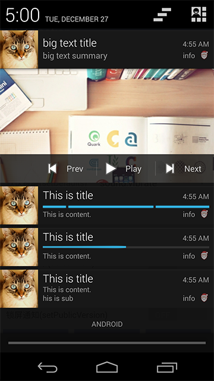
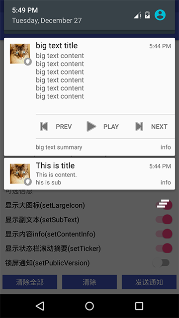
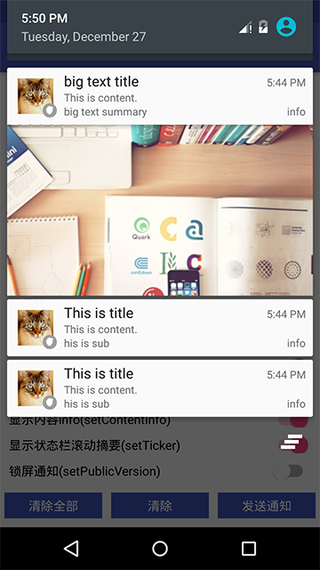
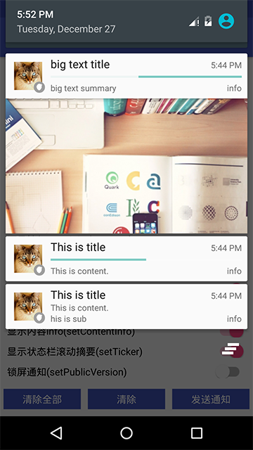
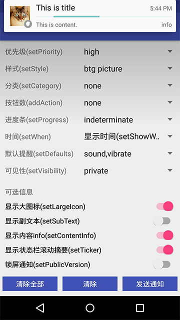
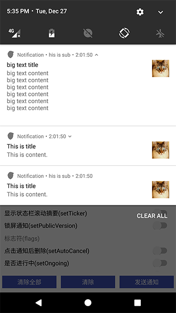
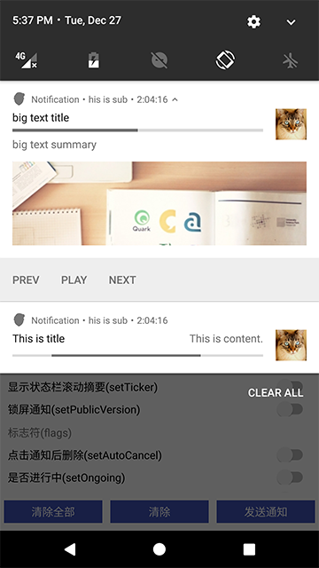
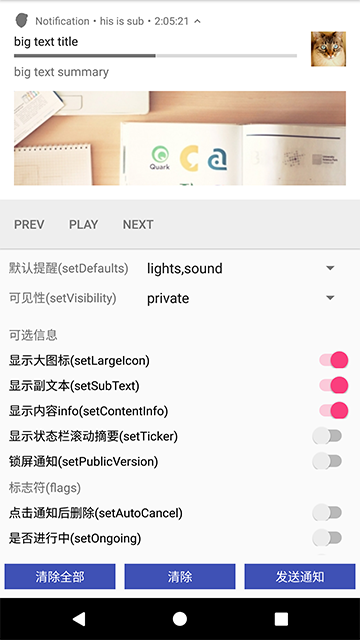

# Notification

通知demo与工具类


  
 
api 19 (android 4.4)

 
  
api 21 (android 5.0)

 
 
    
api 24 (android 7.0)

 



``` java
// 创建通知
NotifyUtil.create(context)
NotifyUtil.create(context, smallIcon, title, content)
NotifyUtil.create(context, largeIcon, smallIcon, title, content)
NotifyUtil.create(context, largeIcon, smallIcon, title, content, contentIntent)

// 发送通知
NotifyUtil.notify(context, notifyId, notification)

// 取消通知
NotifyUtil.cancel(context, notifyId)
NotifyUtil.cancelAll(context)

// 创建 Action
NotifyUtil.makeAction(icon, title, pendingIntent)

// 创建多行文本样式
NotifyUtil.makeBigText(content)
// 创建大图样式
NotifyUtil.makeBigPicture(bitmap)
// 创建收件箱样式
NotifyUtil.makeInbox(messages)
```   
 

## License

```
Copyright 2016 czy1121

Licensed under the Apache License, Version 2.0 (the "License");
you may not use this file except in compliance with the License.
You may obtain a copy of the License at

   http://www.apache.org/licenses/LICENSE-2.0

Unless required by applicable law or agreed to in writing, software
distributed under the License is distributed on an "AS IS" BASIS,
WITHOUT WARRANTIES OR CONDITIONS OF ANY KIND, either express or implied.
See the License for the specific language governing permissions and
limitations under the License.
```